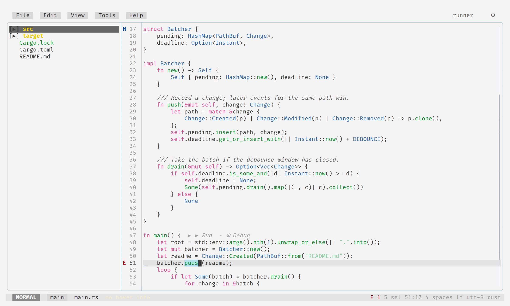
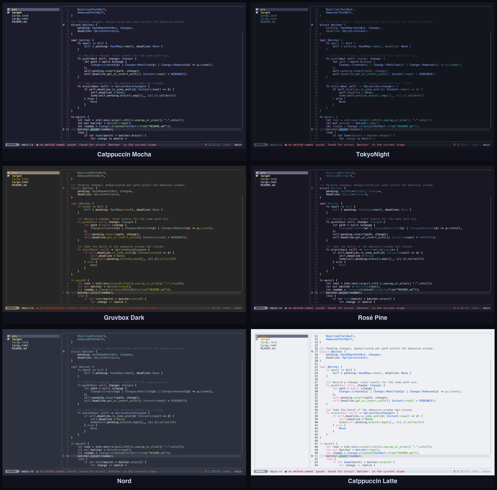

<h1>
<p align="center">
  
  <br>vibin
</p>
</h1>

<p align="center">
  a terminal code editor<br>
  a fun project, built for vibing — i don't recommend using it.
</p>

<picture>
  <source media="(prefers-color-scheme: dark)" srcset="assets/hero-dark.png">
  
</picture>

one TUI, three shells: **F3** code (file tree + modal editor), **F2** git
(stage, diff, commit), **F1** agents (coding agents over the [Agent Client
Protocol](https://agentclientprotocol.com) — Claude, Gemini and friends —
each connection's sessions in one navigable sidebar, with status dots so you
know who's working and who's stuck). the editor
has tree-sitter highlighting for ~30 languages, LSP diagnostics/hover/goto,
spell check that understands `snake_case`, and a hex viewer that decodes
23 binary formats from little `.pat` files. colors come from your
terminal's own theme (queried over OSC), and follow it when it flips
between light and dark.

## themes

vibin has no themes of its own — it asks the terminal for its palette
(over OSC) and colors itself from the answer. the same build, six
terminal themes:



## install

macOS / Linux only. pick your poison:

```sh
# curl | sh — prebuilt binary into ~/.local/bin
curl -fsSL https://raw.githubusercontent.com/szkabaroli/vibin/main/install.sh | sh

# homebrew
brew install szkabaroli/tap/vibin

# nix — run without installing, or add to a profile
nix run github:szkabaroli/vibin -- [dir]
nix profile install github:szkabaroli/vibin

# cargo, from a prebuilt release
cargo binstall vibin --git https://github.com/szkabaroli/vibin

# cargo, from source
cargo install --git https://github.com/szkabaroli/vibin
# …or in a checkout: cargo install --path .
```

then:

```sh
vibin [dir]     # open a workspace; the configured agent connects in F1
```

point vibin at a coding agent with the `agent` config key (a command and its
args) — see [config](#config).

prebuilt binaries (macOS arm64/x86_64, Linux arm64/x86_64, gnu + static
musl) live on the [releases page](https://github.com/szkabaroli/vibin/releases),
each with a `.sha256` and build provenance — the install script verifies the
checksum for you, or `gh attestation verify <tarball> -R szkabaroli/vibin`.

## updating

```sh
vibin +update    # curl|sh installs: fetch + verify + swap the binary in place
```

package-manager installs update through their manager (`brew upgrade vibin`,
`nix profile upgrade`, `cargo binstall … --force`) — `+update` will tell you
which. set `check_for_updates = true` in config to get a once-a-day nudge on
exit when a newer release is out.

## keys

`Ctrl+A` is the leader — press it and a menu shows everything.
`Ctrl+K` is the palette (files, `>` commands). `F1/F2/F3` switch shells.
that's all you need to remember.

## config

`~/.config/vibin/config.toml`, overridden by `.vibin/config.toml` in a repo:

```toml
show_hidden = false
spell_check = true
mark_unicode = true
check_for_updates = false        # daily background check + notice on exit
bell = true                      # ring the bell when an agent needs you
# mouse_scroll_multiplier = 3   # unset = auto per terminal

# the coding agent to connect on open: a command + its args (ACP over stdio)
# agent = ["npx", "@zed-industries/claude-code-acp"]
# title_model = "..."           # OpenRouter model to name sessions (needs OPENROUTER_API_KEY)

# language servers, vim.lsp.config-shaped — override a field of a built-in
# or add your own; root_markers start the server at workspace open
# [lsp.clangd]
# cmd = ["clangd"]
# filetypes = ["c", "cpp"]
# root_markers = ["compile_commands.json"]
```

## license

MIT. vendored grammars, dictionaries, and artwork are credited in
[THIRD-PARTY-NOTICES.md](THIRD-PARTY-NOTICES.md).
